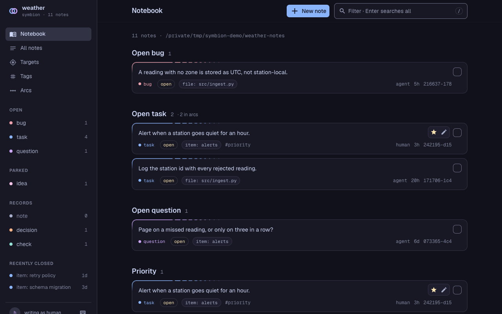

# symbion guide

Install symbion, adopt it in a repo, and run the first session. The
[README](../README.md) has the short version; the [reference](reference.md)
says how symbion behaves.

## Install

Python 3.11+ and git. On Windows, use Git for Windows: catalogs and
resolvers run in its `sh`, which symbion finds beside git even when only
Git's `cmd` directory is on PATH. Claude Code runs the session-start hook in
Git's bash; without Git for Windows it fails with `'sh' is not recognized`.
Codex's hook runs in Windows PowerShell.

```bash
pipx install 'symbion[gui]'     # or: uv tool install 'symbion[gui]'
# [gui] adds the web UI (symbion serve); drop it for the core alone.
# Unreleased main: pipx install 'symbion[gui] @ git+https://github.com/phreakocious/symbion'
```

The core's four dependencies serve a person at a terminal: `rich` and
`rich-argparse` colour and align the output (a pipe gets plain text),
`markdown-it-py` reads note bodies, and `argcomplete` does TAB completion.

Run `command -v symbion` from another directory to check that it is on PATH.
The SessionStart hook finds `symbion` through PATH. Without it, the hook
prints one line in a project that adopted symbion, and nothing elsewhere:
`symbion: cannot read store at … because 'symbion' is not on PATH`.

**TAB completion.** Add your shell's line to its rc file:

```bash
eval "$(symbion completion zsh)"     # ~/.zshrc, after compinit
eval "$(symbion completion bash)"    # ~/.bashrc
symbion completion fish | source     # ~/.config/fish/config.fish
```

In zsh you can instead save the output as `_symbion` in a directory on
`$fpath` (oh-my-zsh: `$ZSH_CUSTOM/completions`). It stays out of a shared rc
file and loads on the first TAB, not at every shell start. Regenerate it after
an argcomplete upgrade.

TAB completes verbs, flags and the store's values: kinds, target types, the
`TYPE:NAME` targets its rows use, row ids (only open ones for `resolve`), arc
ids and tags. zsh and fish describe each value. A `--dir` on the line picks
the store.

## Adopt in a fresh repo

From the repo's root:

**1. Create the store and link the agent files.**

```bash
symbion init          # lists each change and makes none (exit 1 if there are any)
symbion init --yes    # makes them
```

That sets up Claude Code; `--agent codex` sets up Codex instead,
`--agent both` sets up both, and `--agent hermes` sets up Hermes Agent.

This creates `../<repo>-notes`, a git repo with no remote, holding a commented
`symbion.toml` whose every value has a default and a README.md that says what
the store is. Out of the box a note goes on a commit, an item, the project or
an arc. For notes on files, uncomment `file =` under `[catalogs]` and `file =
"git"` under `[renames]`; a file target refused before then names both lines,
by number. For Claude Code, the first
`init` on a machine also links `~/.claude/skills/symbion` to the skill directory in the installed
package (SKILL.md, adoption.md, catalogs.md and the hook script), so an upgrade
reaches every project. It registers the hook in `~/.claude/settings.json` when
that file does not exist. When it does, `init` says the hook is already there,
or prints the entry to append to `hooks.SessionStart` (it merges nothing), or
says the file is not valid JSON. At each session start the hook gives the agent
`symbion summary` and shows you one line of it: the open counts, the soonest due
row and, while `symbion serve` runs, its address. A `~/.claude/skills/symbion` that is not the
link is left alone and named. On Windows the link is a directory junction
when the account cannot make a symlink, so neither Developer Mode nor an
elevated terminal is needed.

For Codex, `init --agent codex` links `~/.agents/skills/symbion` to the same
skill directory and registers the hook in `$CODEX_HOME/hooks.json`
(default `~/.codex/hooks.json`), on the same terms: it writes that file only
when it is absent, and counts a registration inline in `config.toml`. Codex
skips a new hook until you trust it in `/hooks`. See the
[Codex hook documentation](https://learn.chatgpt.com/docs/hooks). On macOS and
Linux the command runs `session_start.sh`. On Windows, init adds a
`commandWindows` override running `session_start.ps1` with Windows PowerShell,
without loading a profile. WSL is not required. Both commands read the
session's cwd and use `codex` as the reader unless `SYMBION_AUTHOR` overrides it.

**Give Codex access to the store.** Codex's sandbox writes only inside the
project, and the store sits beside it. Launch `codex --add-dir
../<repo>-notes`, or add the store to `sandbox_workspace_write.writable_roots`
in Codex's `config.toml`; `init` prints the path. A `.symbion` pointer grants
no access, and `symbion commit` may still ask for approval. A linked worktree
uses the main checkout's store, so grant that one.

For Hermes Agent, `init --agent hermes` makes the same
`~/.agents/skills/symbion` link and registers no hook: no Hermes hook puts
text in front of the model once, at session start. Hermes reads the link once
`$HERMES_HOME/config.yaml` (default `~/.hermes/config.yaml`) lists the
directory. `init` does not edit that file, so add it yourself:

```yaml
skills:
  external_dirs:
    - ~/.agents/skills
```

The summary then comes from a line in the project's `AGENTS.md` (step 3).
Hermes's default local terminal writes to the store beside the project with
no further setup.

The only file `init` writes into the project is a `.symbion` pointer, when the
store is not the default sibling. It marks the pointer `(git: ignored)` or
`(git: not ignored)`; a not-ignored one goes in with your next `git add -A`.
The hook runs in every project and says nothing where there is no store.

**2. Check the read side.** Start a session, or run the hook by hand:

```bash
CLAUDE_PROJECT_DIR=$PWD sh ~/.claude/skills/symbion/session_start.sh
sh ~/.agents/skills/symbion/session_start.sh     # the same, with only Codex set up
```

For Codex on Windows, run this from the project in PowerShell:

```powershell
powershell.exe -NoProfile -NonInteractive -ExecutionPolicy Bypass -File "$HOME\.agents\skills\symbion\session_start.ps1"
```

Hermes Agent has no hook to run: start a session after step 3, and its first
command should be `symbion summary`.

`session_start.sh` prints one JSON line: the text in the table below is its
`additionalContext`, what the agent reads, and its `systemMessage` is the one
line you see at session start. The not-on-PATH line and the `error:` lines
print as plain text, and the PowerShell hook prints all of it that way.

| output | meaning |
|---|---|
| `symbion: open outside arcs: bug 0, task 0, question 0, prediction 0` (`; N open in arcs` when arcs hold any), then a line per arc and the open rows | working |
| `symbion --dir ../other-notes: open outside arcs: …` | working, on a store this repo's tree does not name (`--dir`, `SYMBION_DIR`, or a cwd inside a store); the header names it, so two summaries in one session can be told apart |
| either, then `  N notes not yet in the store's git (symbion commit)` | working; run `symbion commit` at session end |
| either, then `  N per-project symbion copies from an older init: …` | an old `init` left the skill, hook or registration in this project; remove them (the link replaces them) |
| `symbion: cannot read store at … because 'symbion' is not on PATH` | see [Install](#install) |
| `symbion: no store at …; run \`symbion init\`` | no store yet, or `.symbion`/`SYMBION_DIR` names a missing path |
| `error: …/.symbion is a link to …` or `error: cannot read …/.symbion` | `.symbion` is there but is not a file symbion can read; the message gives the fix |
| nothing | no store, no `.symbion` and no `SYMBION_DIR`, or the hook is not registered (or not trusted in Codex) |

**3. Tell the agent.** One line in `CLAUDE.md` (Claude Code) or `AGENTS.md`
(Codex, Hermes Agent):

```
- We use symbion for durable notes and tickets.
```

Hermes Agent runs no hook, so it needs a second line. Hermes reads only the
first of `.hermes.md`, `AGENTS.override.md`, `AGENTS.md` and `CLAUDE.md` it
finds in the project, so put the line in that file:

```
- At the start of a session, run `symbion summary` unless a hook already printed it.
```

If that instruction file is gitignored or its owner reviews every change to it,
propose the line to the owner instead of writing it.

## First session

A repo with history (known issues, TODOs, docs, a handoff file) starts with
`adoption.md`, installed beside `SKILL.md`. It says which catalogs to turn on
and what to bring in; its rows go in as one `symbion add --from-json -`,
validated together before any is written. Either way:

**The first note is a check, written now:** the state the store began at,
which no commit message records. It pays first: dated, re-checkable, and
visibly stale once HEAD moves. A check stamps HEAD and whether the tree is
dirty, untracked files included. Until step 3's line is committed, the tree is
dirty and the check reads `unverifiable (dirty tree)`. Commit, write it again,
and it reads `current`. Files the checked command writes count too, so git-ignore
`__pycache__/` before checking `pytest`. A check on something outside the repo
(DNS, a host) takes `--external` and shows its age instead.

```bash
symbion add check --target commit:HEAD --checked "pytest -q" --result "147 passed"
symbion list --kind check    # unverifiable when dirty, current when clean, behind N once HEAD moves
```

**The first checklist is an arc over free-form items.** `add` each item with a
body. `seed` mints one bodiless task per name and is for fanning out over a
[catalog](reference.md#catalogs-when-a-homogeneous-set-exists).

```bash
aid=$(symbion arc create --name "Adoption" --scope item --desc "Usable by someone who was not in the room.")
symbion add task --target "item:write the README" --arc-id "$aid" --body "Done: a stranger can install and record a note."
symbion arc todo "$aid" --json      # open items
symbion resolve <id>                # tick one: prints the closing row's id, and <id> lists as superseded
symbion arc list                    # done/total per arc
symbion list --arc "$aid" --json    # every item, resolved included
```

**Commit the store at session end.** Writes never commit, so a git failure
never blocks a note; `symbion summary` shows the uncommitted count until you do.

```bash
symbion commit -m "adoption: README ticket closed"
symbion push         # when the store has a remote
```

`commit` says `no remote` while the store has none. A store kept on one disk on
purpose takes `local_only = true` in its `symbion.toml`, and `commit` stops saying so.
With nothing to commit, `commit` exits 1, as git does, so a script's `symbion commit
&& symbion push` stops on a clean store. The first `commit` also takes the files
`init` wrote (`.gitignore`, `README.md`, `symbion.toml`): `init` commits nothing.

## Browse it (optional)

```bash
symbion serve        # the one command that needs the gui extra
```



A local page on a port of the store's own, the same at every restart, so a link
to a row stays good (`serve` prints it, and `--port` picks another). It has:

- boards: by kind on the notebook, by target on the targets page;
- a note list where every tag, kind, author and target is a filter link;
- a search box (`/`): its text filters the page as you type, and Enter
  searches the whole store (every word, literally, in any case, or a pasted
  note id), as a pause in the typing does once nothing on the page matches;
- a new note from any page (`n`), on that page's object or any other: `#tag`
  and `!kind` in its body set its tags and kind, and Shift Enter adds it and
  starts the next;
- a page per note: a rule in its body marks where each amendment joined it,
  with who added it and when, and its earlier versions show an edit as a
  diff; a tag index, and arc checklists you tick;
- commit and push buttons, shown while there is something to commit or push.
  The commit button takes only the rows written as you, so an agent's
  pending rows stay for it to commit.

`?` lists the keys. It writes as **you**: `SYMBION_AUTHOR`, else git
`user.name`, shown at the foot of the sidebar, or in the top bar on a window
too narrow for one. `--author NAME` overrides.

It listens on 127.0.0.1, for this machine only, and answers only at `localhost`
or an IP address: any other name in the address bar gets a 403, because a web
page reaches a local server under a name of its own. To browse it from another
machine, `--host 0.0.0.0` listens on every address and `--allow` names who may
connect, an address or a network, once each: `symbion serve --host 0.0.0.0
--allow 192.168.1.0/24`. This machine always may, and `serve` refuses a `--host`
past loopback with no `--allow`. There is no login: every machine allowed writes
as the serve's author.

One `serve` per store: run it in each project, and each one's sidebar links
the other stores a `serve` is running on, on this machine. Each running
`serve` keeps a small record in `~/.cache/symbion/serve/` (or under
`$XDG_CACHE_HOME`). A second `serve` on one store warns: the sidebars link the
first until it stops, then the second. While a `serve` runs on a store, each id
that `list`, `show` and `context` print at a terminal links to its row's page
(cmd-click in iTerm2), and `summary` names the URL.

A running `serve` keeps the symbion it started with. After an upgrade,
`symbion serve --restart`, run from anywhere, restarts every one in place: in
its own terminal, on its own port, and its open tabs reload. `--stop` stops
them all. Neither works on Windows: there, Ctrl-C each one and start it again.
